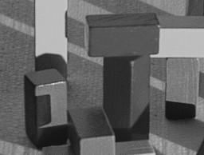
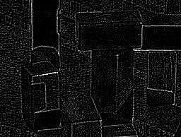
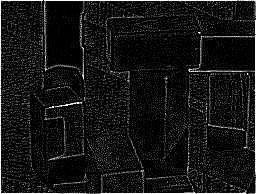

# Image Processing Results

This directory contains output images generated by the FilterDXI testbench. Each image illustrates how a specific filter configuration modifies the same input picture.

## Original image

## Laplacian filter (2 taps)

**Mirror padding**

**Constant padding**

**Zero padding**

## Laplacian filter (1 tap)

## Averaging filter

**Constant padding**

**Zero padding**

## Gaussian filter

**Mirror padding**

**Zero padding**

